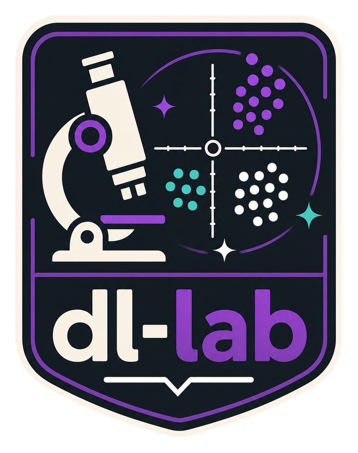
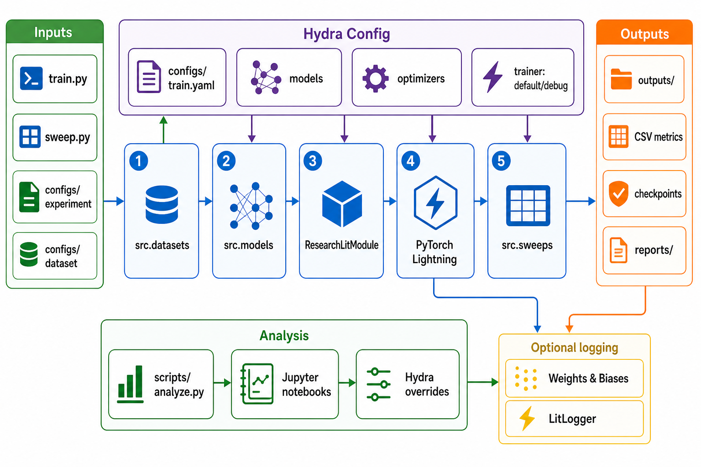

<div align="center">
  

  **🧪 Fast, reproducible deep learning experiments from local runs to cloud sweeps 🧪**
</div>

`dlab` is a small research framework for running controlled deep learning experiments from Hydra configs. It is built for local training loops, sequential sweeps, CSV-backed metrics, checkpoints, markdown reports, and notebook-based analysis.

The repo currently covers MNIST, Fashion-MNIST, and CIFAR-10 with classifiers and autoencoders built on PyTorch Lightning.

## Install

```bash
git clone git@github.com:tsilva/dlab.git
cd dlab
uv sync
```

Run a debug training pass:

```bash
uv run python train.py experiment=mnist_mlp trainer=debug dataset.num_workers=0 wandb.enabled=false
```

## Commands

```bash
uv run python train.py experiment=mnist_mlp                         # run a named experiment
uv run python train.py experiment=mnist_mlp optimizer.lr=1e-4       # override Hydra config values
uv run python train.py experiment=mnist_vae wandb.enabled=false     # disable W&B for a local-only run
uv run python train.py experiment=mnist_mlp litlogger.enabled=true  # enable LitLogger for a run
uv run python train.py experiment=mnist_mlp launcher=modal          # submit one run to Modal
uv run python train.py experiment=mnist_mlp launcher=modal_gpu      # Modal GPU defaults
uv run python train.py experiment=mnist_mlp launcher=runpod_flash   # submit one run to RunPod Flash
uv run python sweep.py sweep=lr                                     # run a sequential sweep
uv run python sweep.py sweep=mlp_lr backend=wandb                   # create a W&B sweep from Hydra config
uv run python sweep.py sweep=mlp_lr backend=wandb wandb_sweep.start_agent=true
uv run python roadmap.py list                                       # inspect the learning roadmap
uv run python roadmap.py run 01_mlp_basics --backend wandb          # create/run a roadmap stage through W&B sweeps
uv run python sweep.py sweep=lr launcher=modal                      # submit sweep runs through Modal
uv run python scripts/analyze.py summary outputs/mnist-mlp-baseline-adam-lr0p001-bs64-w256-d2-do0p1-seed1337
uv run python scripts/analyze.py compare outputs/a outputs/b        # compare runs by validation loss
uv run python scripts/analyze.py wandb-study mlp_lr --report        # summarize a W&B study
uv run jupyter lab                                                  # open analysis notebooks
uv run ruff check .                                                 # lint the project
```

Run names are generated automatically from dataset, model, study, optimizer, learning rate, batch size, key model parameters, sweep metadata, and seed.

## Learning roadmap

`configs/roadmap/default.yaml` defines the learning path as stages. Each stage lists studies, and each study maps to either `configs/sweep/<study>.yaml` or `configs/experiment/<study>.yaml`.

Study and sweep configs can carry learning metadata under `run`: stage, study, question, hypothesis, expected pattern, controlled variables, changed variables, and tags. This metadata is forwarded into W&B run tags, notes, config, and reports.

W&B is intended to be the comparison layer:

- W&B Sweeps handle parallel sweep scheduling and agents.
- W&B run summaries store best metrics, parameter counts, runtime, and generalization gap.
- W&B Tables store prediction or reconstruction examples.
- W&B Artifacts store resolved configs, metrics CSVs, checkpoints, and markdown reports.
- `scripts/analyze.py wandb-study <study> --report` pulls matching W&B runs and writes a study report.

## Execution launchers

`dlab` uses Hydra launcher configs to choose where an experiment runs:

- `launcher=local` is the default and runs the existing PyTorch Lightning flow in the current process.
- `launcher=modal` runs the same experiment function on Modal. Install and authenticate with `uv add modal` and `modal setup`.
- `launcher=modal_gpu` uses Modal with remote GPU defaults: L4, `dataset.num_workers=16`, and `runtime.float32_matmul_precision=medium`.
- `launcher=runpod_flash` runs the same experiment function through RunPod Flash. Install and authenticate with `uv add runpod-flash` and `uv run flash login`, then deploy the endpoint with `uv run flash deploy --python-version 3.12`.

Provider settings live in `configs/launcher/`. Common overrides:

```bash
uv run python train.py experiment=mnist_mlp launcher=modal launcher.gpu=A10
uv run python train.py experiment=mnist_mlp launcher=runpod_flash launcher.workers=[0,2]
```

For a minimal RunPod Flash smoke test:

```bash
uv run flash deploy --python-version 3.12
FLASH_SENTINEL_TIMEOUT=600 uv run python train.py experiment=mnist_mlp trainer=debug launcher=runpod_flash wandb.enabled=false litlogger.enabled=false reports.enabled=false dataset.num_workers=0
```

The first RunPod Flash call can spend several minutes starting a worker and installing dependencies. `FLASH_SENTINEL_TIMEOUT` extends the local client wait. Endpoint hardware and scaling are read from `configs/launcher/runpod_flash.yaml` during `flash deploy`, so redeploy after changing GPU, workers, dependencies, or timeout settings.

Remote providers receive the project source needed to import `src`, dependency metadata, and the resolved run config. They do not need the Hydra `configs/` directory at runtime because the launcher passes a fully resolved config to the remote function. Remote workers write normal run outputs inside the worker filesystem; use W&B, LitLogger, or another artifact store for results that must persist outside the remote runtime.

## Notes

- Python 3.12 or newer is required.
- `uv.lock` is present, so setup is through `uv sync`.
- Hydra configs in `configs/` are the main execution interface.
- Local datasets are cached under `datasets/`; generated runs, metrics, checkpoints, and resolved configs go under `outputs/`.
- Reports are written to `reports/` when `reports.enabled` is true.
- W&B is enabled by default; LitLogger is optional and disabled by default in `configs/train.yaml`.
- This is a local research workspace, not production ML infrastructure.

## Architecture


